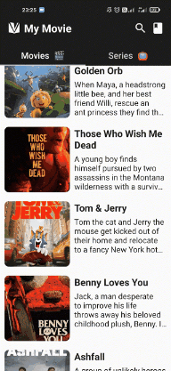

# Final submission Dicoding Academy Android Jetpack Pro
This is an app i created for accomplish task from [Dicoding](https://www.dicoding.com/) on subject [BAJP](https://www.dicoding.com/academies/129) and i got 5 star of 5 you can see my certificate [here](https://www.dicoding.com/certificates/ERZR5V5QOPYV), by the way if you found my project because you wanted to accomplish your final task from **Dicoding** also please use this as reference do not copy all of the code or it'll be counted as **Plagiarism**

## Attention ⚠
i'm using TMDb API here hence you need to create your own KEY API first to running this code properly, you can visit [here](https://www.themoviedb.org/login) to create your account first and go to settings click to API [here](https://www.themoviedb.org/settings/api)

### After you get KEY API, you must create one more thing
click on your file, select new file and named **gradle.properties**
and the add this all code inside the file :
```
org.gradle.jvmargs=-Xmx2048m -Dfile.encoding=UTF-8
android.useAndroidX=true
android.enableJetifier=true
kotlin.code.style=official
API_KEY = "" -> (place your KEY API here)
```

## This is what i have to do to accomplish the task
**Main Page**
- Have 2 page to display both list Movie and Series
- implementing ViewModel, LiveData and Repository to collect data Movies and Series 

**Detail Page**
- display poster and movies information
- implementing ViewModel to collect data from Main Page

**Favorite Page**
- can store movie to database
- can remove movie from database
- must have a page to display list Favorite movies
- must have a page to display list Favorite series
- Implementing Room to store both data Movie and Series
- Implementing Pagination to organize data on RecyclerView

**Unit Test**
- Implementing unit test to all of Function in Repository and ViewModel to Collect the Data

**Instrumentation Tests**
- Implementing Instrumentation test to make sure all features can work properly
- If there are have *asynchronous* process then it's mandatory to implementing *Idle Resources*

## Tools
- [Lifecycle & LiveData](https://developer.android.com/jetpack/androidx/releases/lifecycle)
- [Navigation Component](https://developer.android.com/jetpack/androidx/releases/navigation)
- [Dagger Hilt](https://dagger.dev/hilt/)
- [Retrofit 2](https://square.github.io/retrofit/)
- [Glide](https://github.com/bumptech/glide)
- [MVVM](https://developer.android.com/jetpack/guide)
- [ROOM](https://developer.android.com/jetpack/androidx/releases/room)
-  [Smooth Loader](https://github.com/nntuyen/mkloader)
- [View Binding](https://developer.android.com/topic/libraries/view-binding?hl=en)
- [Paging3](https://developer.android.com/topic/libraries/architecture/paging/v3-overview)
-[ViewPager2](https://developer.android.com/jetpack/androidx/releases/viewpager2?hl=id)
- [Kotlin Coroutines Flow](https://kotlin.github.io/kotlinx.coroutines/kotlinx-coroutines-core/kotlinx.coroutines.flow/-flow/)
- [Truth](https://kotlin.github.io/kotlinx.coroutines/kotlinx-coroutines-core/kotlinx.coroutines.flow/-flow/)

## End Point
- Movie Now Playing : [/movie/now_playing](https://developers.themoviedb.org/3/movies/get-now-playing)
- Detail Movie : [/movie/{movie_id}](https://developers.themoviedb.org/3/movies/get-movie-details)
- TV on Airing : [/tv/on_the_air](https://developers.themoviedb.org/3/tv/get-tv-on-the-air)
- Detail TV : [/tv/{tv_id}](https://developers.themoviedb.org/3/tv/get-tv-details)
- Search : [/search/multi](https://developers.themoviedb.org/3/search/multi-search)


## Features
**Main Page**
<div>
    <p>
        In Main Page just to display both list Movie and Series.
        i'm using ViewPager2 to split them and to make user easily can navigate between movie and series just by swiping to the left or right in here too i'm using TabLayout so user can know what's tab opened now
    </p>
    
</div>

**Detail Page**
<div>
    <p>
       here just to display all information about the movies or series user click from main page and from this page user can mark that movie or series as favorite and can easy to find the movie/series which has mark favorite
    </p>
    
</div>

**Favorite Page**
<div>
    <p>
       This page have 2 page like main page i use ViewPager2 and TabLayout to split both of them to make user can easily find their favorite movie or series
    </p>
    
</div>

**Search Page**
<div>
    <p>
       This the page for user to find movie or series they want to find out
    </p>
    
</div>


